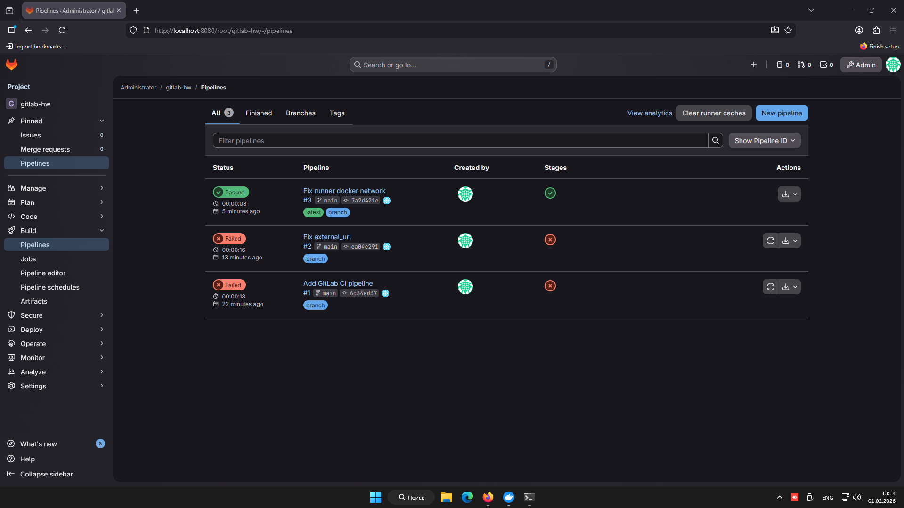
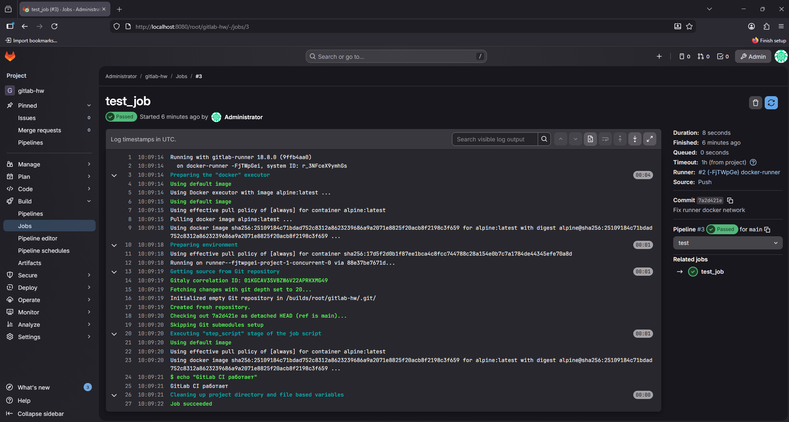

# Домашнее задание к занятию «GitLab» - `Шумихин Кирилл`

### Инструкция по выполнению домашнего задания

   1. Сделайте `fork` данного репозитория к себе в Github и переименуйте его по названию или номеру занятия, например, https://github.com/имя-вашего-репозитория/git-hw или  https://github.com/имя-вашего-репозитория/7-1-ansible-hw).
   2. Выполните клонирование данного репозитория к себе на ПК с помощью команды `git clone`.
   3. Выполните домашнее задание и заполните у себя локально этот файл README.md:
      - впишите вверху название занятия и вашу фамилию и имя
      - в каждом задании добавьте решение в требуемом виде (текст/код/скриншоты/ссылка)
      - для корректного добавления скриншотов воспользуйтесь [инструкцией "Как вставить скриншот в шаблон с решением](https://github.com/netology-code/sys-pattern-homework/blob/main/screen-instruction.md)
      - при оформлении используйте возможности языка разметки md (коротко об этом можно посмотреть в [инструкции  по MarkDown](https://github.com/netology-code/sys-pattern-homework/blob/main/md-instruction.md))
   4. После завершения работы над домашним заданием сделайте коммит (`git commit -m "comment"`) и отправьте его на Github (`git push origin`);
   5. Для проверки домашнего задания преподавателем в личном кабинете прикрепите и отправьте ссылку на решение в виде md-файла в вашем Github.
   6. Любые вопросы по выполнению заданий спрашивайте в чате учебной группы и/или в разделе “Вопросы по заданию” в личном кабинете.
   
Желаем успехов в выполнении домашнего задания!
   
### Дополнительные материалы, которые могут быть полезны для выполнения задания

1. [Руководство по оформлению Markdown файлов](https://gist.github.com/Jekins/2bf2d0638163f1294637#Code)

---

# Домашнее задание к занятию «GitLab»

## Задание 1
GitLab был развернут локально с использованием Docker.
Для проекта создан пустой репозиторий.
GitLab Runner был запущен и зарегистрирован в режиме Docker.

В процессе настройки возникла проблема с доступом runner к GitLab по имени хоста.
Проблема была решена настройкой параметра `external_url` GitLab и указанием
`network_mode` для Docker executor в конфигурации runner.

## Задание 2
В репозитории был создан файл `.gitlab-ci.yml`, описывающий простой pipeline.
Pipeline успешно выполняется, что подтверждается успешным выполнением job.

В качестве ответа в шаблон с решением добавьте: Шаблон в репозиторе. 