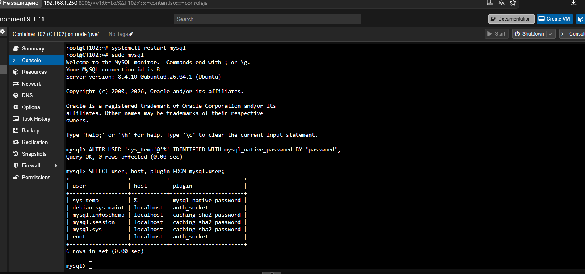
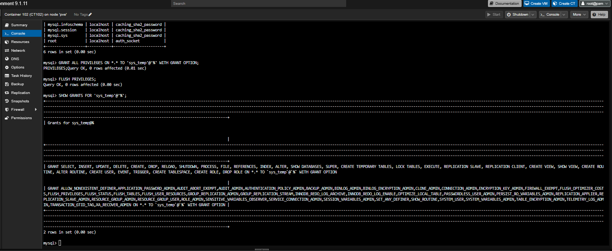
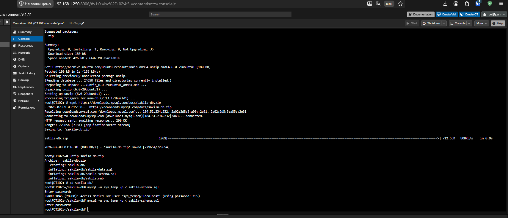
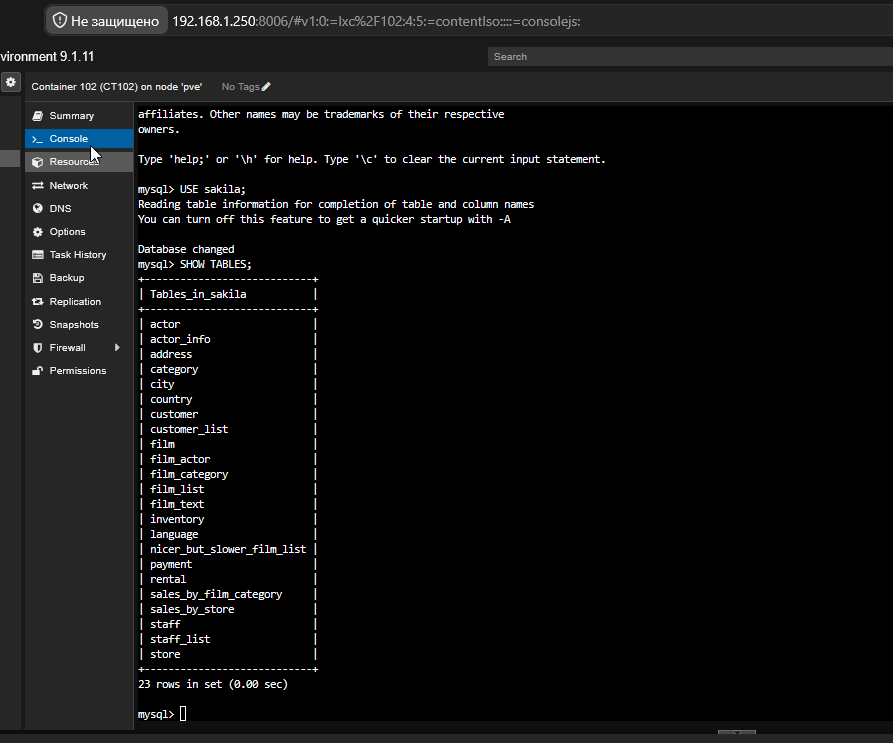
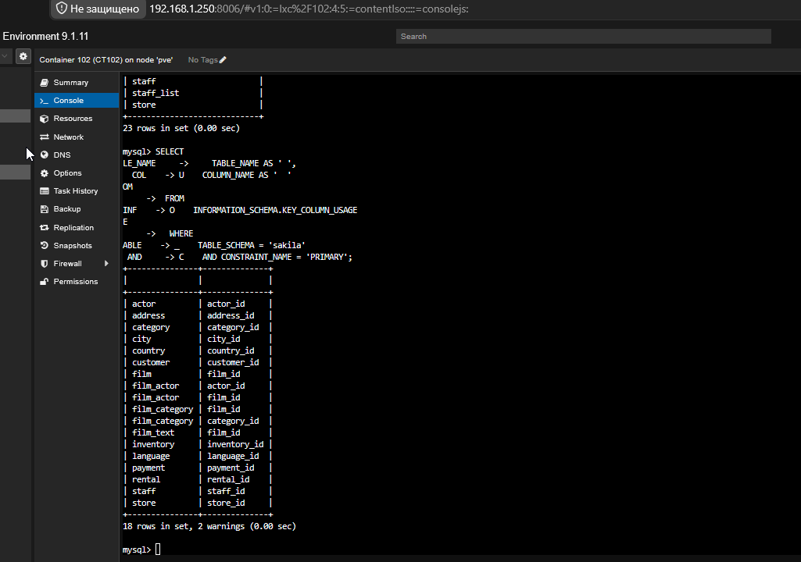
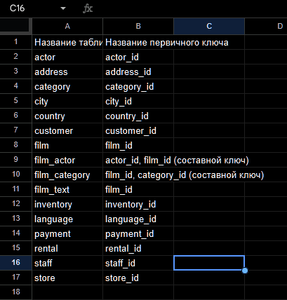

# Отчёт по домашнему заданию: Настройка MySQL и базы данных Sakila

## Задание 1

### Пункт 1.3: Запрос на получение списка пользователей
Вот скриншот со списком пользователей и активным плагином `mysql_native_password`:

### Пункт 1.5: Получение списка прав для sys_temp
Подтверждение выдачи полных глобальных привилегий:

### Пункт 1.7: Восстановление дампа базы данных
Процесс загрузки и успешного наката дампов структуры и данных Sakila DB:

### Пункт 1.8: Список таблиц базы данных Sakila
Вывод всех сущностей и системных представлений после импорта:

---

## Задание 2: Таблица первичных ключей

### Результат выполнения SQL-запроса к INFORMATION_SCHEMA
Скриншот терминала с выгрузкой метаданных из системного словаря:

### Скриншот итоговой таблицы
Финальный вариант отчёта из Excel / текстового редактора с объединёнными составными ключами:

### Дополнительный скриншот окружения (при необходимости)
